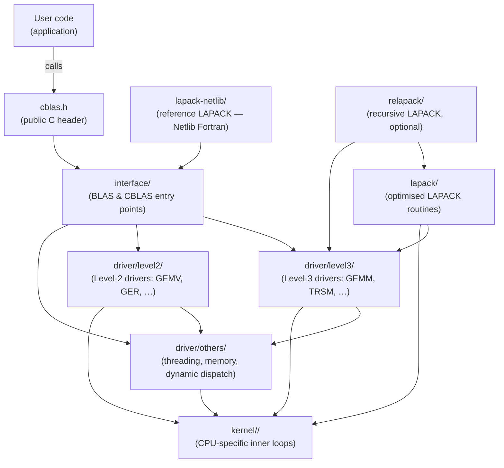
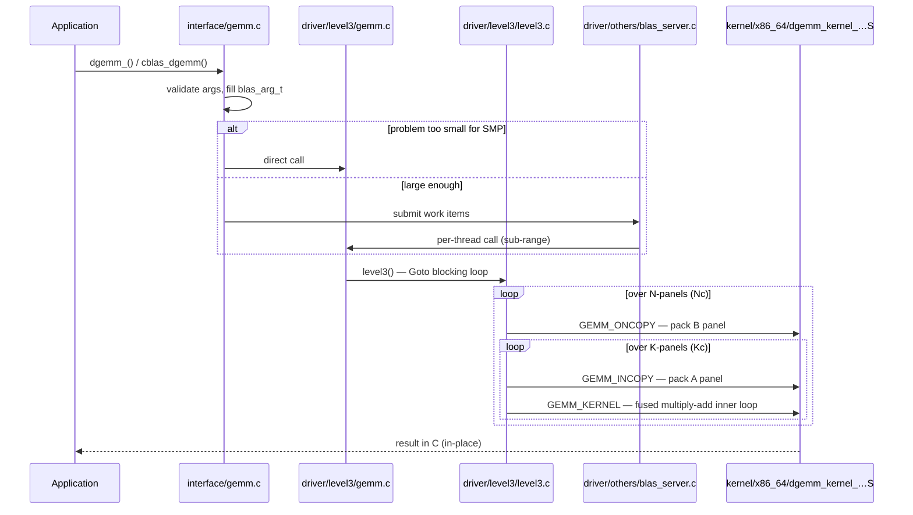
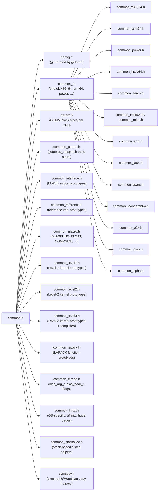
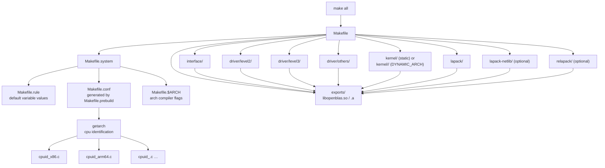
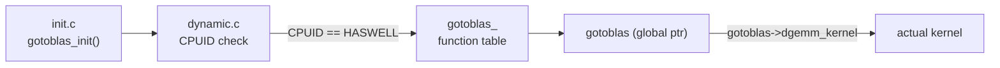

# OpenBLAS File & Module Dependency Maps

This document provides dependency maps between the files and modules of
OpenBLAS to help with reverse engineering and navigating the codebase.

## Module Dependency Graph

The diagram below shows which top-level modules depend on which others at
link/compile time.



## Call Flow for `dgemm` (Representative Level-3 Example)



## Header Include Graph

`common.h` is the single master include used by every `.c` / `.S` source file.
It pulls in all per-topic sub-headers conditionally.



## Build-Time Dependency Graph

The Makefile system has the following dependency order at build time.



## `interface/` → Kernel Dependency Map

Each interface file includes `common.h`, which provides macros that resolve to
the correct kernel symbol at link time.  The table below shows the mapping for
the most important Level-3 and Level-2 operations.

| Interface file | Driver file(s) | Core kernel symbols |
|---------------|---------------|---------------------|
| `interface/gemm.c` | `driver/level3/gemm.c` → `level3.c` | `GEMM_KERNEL`, `GEMM_INCOPY`, `GEMM_ITCOPY`, `GEMM_ONCOPY`, `GEMM_OTCOPY`, `GEMM_BETA` |
| `interface/trsm.c` | `driver/level3/trsm_L.c`, `trsm_R.c` | `TRSM_KERNEL_LN`, `TRSM_KERNEL_LT`, … |
| `interface/syrk.c` | `driver/level3/syrk_k.c` | `SYRK_KERNEL_U`, `SYRK_KERNEL_L` |
| `interface/symm.c` | `driver/level3/symm_k.c` | `SYMM_KERNEL_L`, `SYMM_KERNEL_U` |
| `interface/gemv.c` | `driver/level2/gemv_thread.c` | `GEMV_N`, `GEMV_T` |
| `interface/ger.c`  | `driver/level2/ger_thread.c` | `GER_K` |
| `interface/trsv.c` | `driver/level2/trsv_L.c`, `trsv_U.c` | `TRSV_L`, `TRSV_U` |
| `interface/axpy.c` | — (no separate driver) | `AXPY_K` |
| `interface/dot.c`  | — | `DOT_K` |
| `interface/scal.c` | — | `SCAL_K` |

## `kernel/<arch>/KERNEL.<CPU>` Selector Files

Each `KERNEL.<CPU>` file sets make variables that override the generic defaults.
The kernel loader flow is:

```
Makefile.system
    └─ reads $(TARGET) from Makefile.conf
          └─ kernel/$(ARCH)/Makefile  includes KERNEL.$(TARGET)
                 └─ sets  DGEMMKERNEL = dgemm_kernel_4x8_haswell.S
                          DGEMM_INCOPY = dgemm_ncopy_4_haswell.S
                          …
```

Example — `kernel/x86_64/KERNEL.HASWELL` (excerpted):

```makefile
DGEMMKERNEL    = dgemm_kernel_4x8_haswell.S
DGEMM_INCOPY   = dgemm_ncopy_4_haswell.S
DGEMM_ITCOPY   = dgemm_tcopy_4_haswell.S
DGEMM_ONCOPY   = dgemm_ncopy_8_haswell.S
DGEMM_OTCOPY   = dgemm_tcopy_8_haswell.S
SGEMMKERNEL    = sgemm_kernel_8x8_haswell.S
…
```

## Dynamic Dispatch Dependency (`DYNAMIC_ARCH=1`)



All kernel calls in `driver/` go through the `gotoblas` global pointer when
`DYNAMIC_ARCH` is enabled, making the dispatch completely transparent to the
rest of the code.

## Header-to-Source Ownership Map

| Header | Primary owner / topic |
|--------|----------------------|
| `common.h` | Master include, included by all C sources |
| `common_interface.h` | Public BLAS prototype declarations |
| `common_level1.h` | Level-1 kernel function declarations |
| `common_level2.h` | Level-2 kernel function declarations |
| `common_level3.h` | Level-3 macro templates (GEMM copy/kernel roles) |
| `common_lapack.h` | LAPACK function declarations |
| `common_thread.h` | Threading structs & constants (`blas_arg_t`, flags) |
| `common_param.h` | `gotoblas_t` struct (per-CPU function pointers) |
| `common_macro.h` | `BLASFUNC`, `FLOAT`, `COMPSIZE`, precision macros |
| `common_x86_64.h` | x86-64 register/ABI definitions |
| `common_arm64.h` | AArch64 definitions |
| `common_linux.h` | Linux-specific OS helpers |
| `param.h` | Static GEMM block sizes per CPU (`GEMM_P`, `GEMM_Q`, `GEMM_R`) |
| `l1param.h` | Level-1 tuning (copy block size) |
| `l2param.h` | Level-2 tuning (SYMV block size) |
| `cblas.h` | Public CBLAS C header installed with the library |
| `cpuid.h` | x86 CPUID helper macros |
| `version.h` | Library version string |
| `openblas_config_template.h` | Template for the installed `openblas_config.h` |

## Key Data Structures

```
blas_arg_t  (common_thread.h)
├── m, n, k          — matrix dimensions
├── alpha, beta      — scalars
├── a, b, c          — matrix pointers
├── lda, ldb, ldc    — leading dimensions
└── common           — pointer to blas_common_t runtime state

gotoblas_t  (common_param.h)  — per-CPU dispatch table
├── dgemm_kernel(...)
├── dgemm_incopy(...)
├── sgemm_kernel(...)
├── (one function pointer per precision × operation)
└── dtb_entries, switch_ratio, offsetA, offsetB, align

blas_pool_t  (common_thread.h)  — thread pool
├── pthread_t thread[NUM_THREADS]
├── blas_queue_t *queue          — work queue head
└── volatile int  shutdown
```
